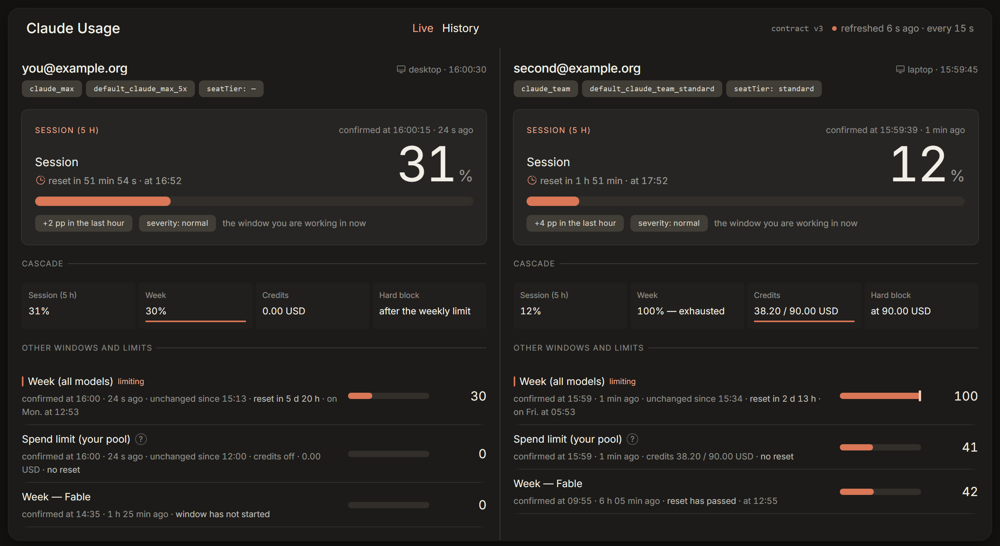
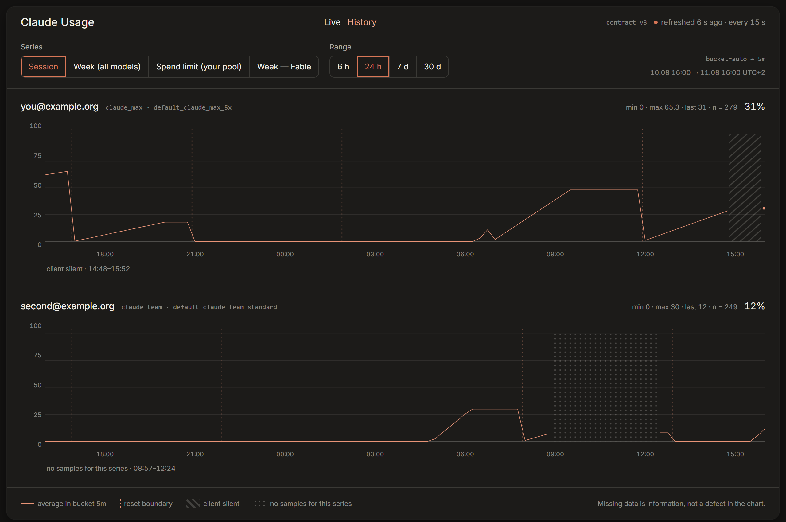
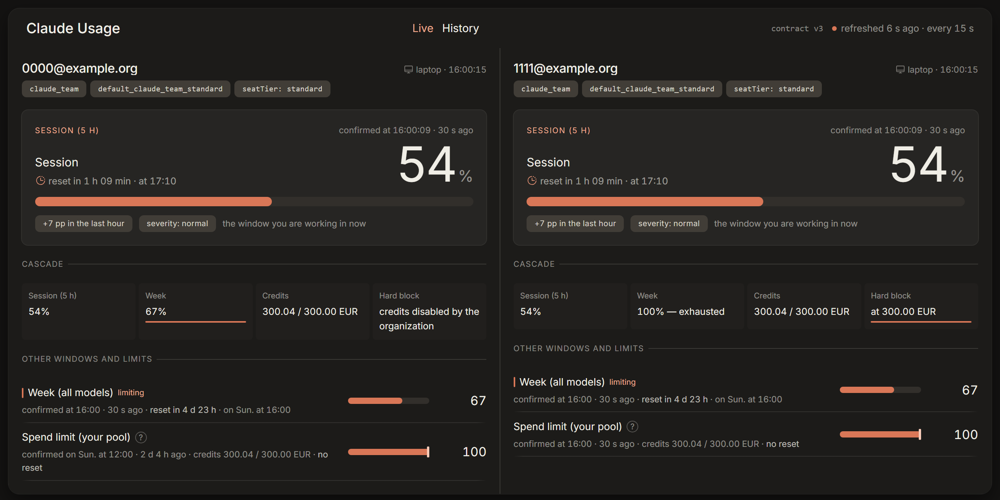
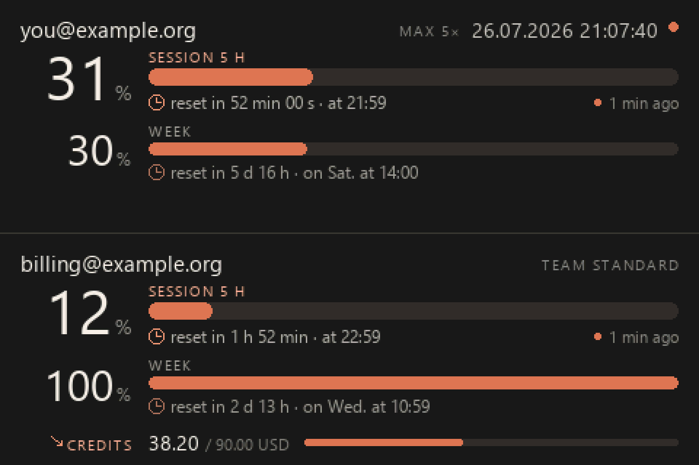
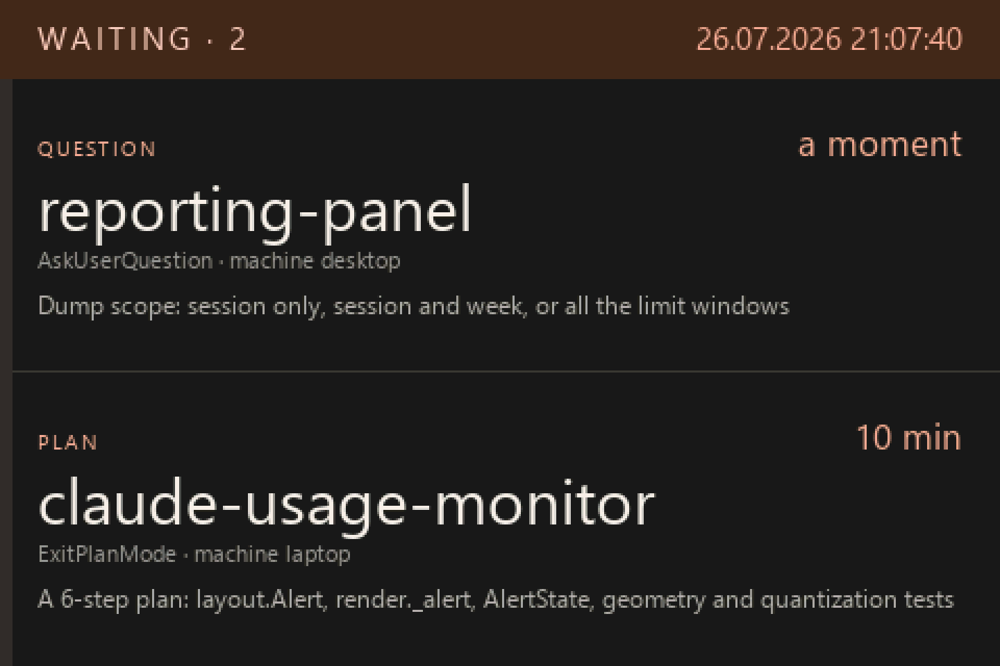

# Claude Usage Monitor

**How much of your Claude limit is left — every account, every machine, on one page.**
Before you start the big task, not halfway through it.



## ✨ What it gives you

- 📊 **All your accounts side by side.** Max, Team, work, private — whichever ones you sign in
  to. They are recognized by themselves; there is nothing to label.
- ⏳ **The current 5-hour session and the weekly window,** each with the percentage used and the
  time left until it resets.
- 🪜 **What happens when a window runs out** — paid credits first, then a hard stop — shown as
  the ladder it actually is, so you can see the next rung coming.
- 📈 **History,** so "am I burning through this faster than usual?" has an answer.
- 🖥️ **A small screen on your desk** (optional) showing the same thing, without a browser tab.
- 🔔 **A nudge when Claude is stuck waiting for you** — a question, a permission, a plan to
  accept — so a walk to the kitchen doesn't cost you twenty idle minutes.
- 🤫 **A number you can trust.** When a reading is old or missing, it says so. It never shows a
  confident 0%, because that is exactly the number you would act on.

## 📈 History



The last 6 hours, 24 hours, 7 or 30 days, one series at a time across every account. Gaps are
drawn as gaps — a period with no measurements looks different from a period of no usage, and the
legend says which is which.

## 🪜 When a window runs out



Running out of the weekly window is rarely the end — on paid plans the work continues on credits,
up to a ceiling, and only then stops for good. The row of tiles reads left to right and marks the
rung you are standing on, plus the amount that is left on it. If an organization switches credits
off, that is shown too, instead of a silent zero.

## 🖥️ On the desk



A 480x320 USB display next to the keyboard shows the same numbers for every account, always on,
with no browser tab and no window to raise. Supported panels, wiring and setup:
[`panel/README.md`](panel/README.md#installation).



And when a session is waiting for you, the panel says so — which project, what kind of question,
and how long it has been sitting there. The design, in pictures:
[`docs/PANEL-ALERT-HANDOUT.md`](docs/PANEL-ALERT-HANDOUT.md).

## 🔒 Is this safe for my account?

- **Nothing is ever sent to Anthropic's API.** The number is read from Claude Code itself, which
  already knows it.
- **Your login token is never used to log in anywhere.** It is not sent, not copied, and the
  refresh mechanism — the usual way people lose an account to a tool like this — is never
  touched. [Details](#how-the-measurement-is-taken).
- **Asking about the limit does not spend the limit.** Measured: zero model turns, zero cost.
  [How that works](#what-we-do-instead).
- **Your own machine, your own server.** Nothing goes to a third party;
  [without a server](#installing-the-client-on-a-new-machine) the probe just writes a local log.

## 🚀 Try it

Your own server, two commands ([the details](#server-deployment)):

```bash
cp .env.example .env      # MARIADB_*, AUTH_MODE, INGEST_TOKENS
docker compose up -d --build
```

Then connect a machine — requirements, tokens and hooks, step by step:
[`client/README.md`](client/README.md#installation).

---

The rest of this file is the engineering side: what is built, why it is built this way, and how
to run it.

## How the measurement is taken

Data is collected by a probe run from a Claude Code hook **on the user's machine**. The probe
**sends no request to `api.anthropic.com`** — the measurement is delegated to Claude Code itself
(`claude -p "/usage"`, zero limit consumption), and the probe reads the result off disk, then sends
the monitor just that measurement.

No token ever leaves the machine, and **none is used to authenticate anything** on our side: the
request is made by the first-party client with its own, self-refreshing token. The token endpoint
is never called, so the main vector for losing an account — rotation of the one-time refresh
token — does not apply here at all.

## Status

| Piece | State |
|---|---|
| Probe + hooks (12 events, `async`) | working |
| Backend + MariaDB in Compose | working |
| Authorization gate: `none` / `header` / `verify` | working |
| Read API, contract v3 | working |
| UI — **Live** and **History** | working |
| Desk panels over SSE — AX206 and Turing rev A | working |
| "Claude is waiting for you" alert — toast plus card, and a marker on the panel | working; four card layouts depending on the number of blocks |

Diagnostics (events, batches, machines, raw payloads) were deliberately left at `curl` —
see [docs/API.md](docs/API.md) § 10.

Panels: installation, `panel.json`, and **identifying a unit by its USB port chain** (`port_path`,
`--list`, `--identify`) — [`panel/README.md` → Installation](panel/README.md#installation).

A typical deployment puts this behind a reverse proxy with SSO, but that's one of three options,
not a project assumption. Installing it on your own machine needs nothing in front of the backend.

## Architecture

```
machine running Claude Code                          server
┌───────────────────────────────┐
│ 12 hooks (async), incl.       │
│PostToolUse, PermissionRequest │
│        ↓                      │      HTTPS + Bearer + X-Ingest-Key
│ client/usage-probe.py         │ ───────────────────────────────────►  Apache
│ · delegates `claude -p /usage`│                                         │
│ · reads cache + stdout        │       /claude-usage/api/ingest        ──► backend
│ · 60 s throttle               │       /claude-usage/api/session-alert ──► backend
│ · spool on failure            │       /claude-usage/api/*             ──► backend (gate)
│ · blocked-session alert       │       /claude-usage/                  ──► backend (statics)
└───────────────────────────────┘                          ┌──────────────┴──────────────┐
                                                            │ backend  FastAPI :8000       │
                                                            │   + built frontend           │
                                                            │ mariadb  (internal network)  │
                                                            └──────────────────────────────┘
```

**Two containers, not three.** The backend serves the UI statics (the `node` stage in its
Dockerfile builds them). A separate nginx with `auth_request` hides a trap: `$scheme`
inside the container is `http` and `$request_uri` carries no prefix — so the return after login
lands on the service's root. Here the gate is the backend itself, building `redirect_url` from
explicit `PUBLIC_ORIGIN` + `APP_BASE_PATH`.

## Why this way, not another

Approaches tried and rejected:

- **Statusline hook** — would be free (zero API calls), but **does not work in the VS Code
  extension**; it's a CLI/TUI-only feature ([#55643](https://github.com/anthropics/claude-code/issues/55643),
  closed as `not_planned`). The reference repo is built on exactly this mechanism, which is
  precisely why it isn't a path for us. It also only gives `five_hour` and `seven_day` — no
  cascade, no dollar quotas, no `is_active` and no `severity`.
- **Server-side poller** — would require holding tokens and **rotating the refresh token**,
  which is exactly what causes account loss.
- **Parsing local JSONL** — inaccurate; CCUM issue #202 documents a 1.4% vs 12% gap against
  the server.
- **Calling `/api/oauth/usage` directly** — worked (probe version 2), but required using the
  OAuth token and impersonating `User-Agent: claude-code/…`. Anthropic's terms forbid using
  those tokens *"in any other product, tool, or service"*, with no exception for read-only use.
- **`--debug api` as a source** — checked, **does not dump the response body** of the endpoint.
  If it did, the whole two-source setup below would be unnecessary.

### What we do instead

The measurement is delegated to **Claude Code itself**: `claude -p "/usage"`. The command is
registered twice, and the `supportsNonInteractive` variant returns `{type:"text"}` →
`shouldQuery=false`, so **no model turn happens at all**. Measured: `num_turns=0`,
`duration_api_ms=0`, `total_cost_usd=0`, ~3.4 s per call. Measuring the limit does not consume
the limit.

The probe reads the result from two places, because freshness and completeness live in
different spots:

| Source | Freshness | Content |
|---|---|---|
| stdout of `/usage` | fresh on every call | percentages of the main windows |
| `~/.claude.json` → `cachedUsageUtilization` | ≤ 5 min | the full raw response body |

Claude Code's five-minute throttle applies to **writing to disk**, not to fetching — hence this
section. The probe merges one with the other, and the result has exactly the same shape as the
old HTTP response, so the backend's parser needed no changes.

## Key design decisions

**An open set of series.** The response has 17 top-level keys, 5 of which were known neither
from the validator inside the Claude Code binary nor from the reference repo. Series are rows
in the table, not columns — a new bucket at Anthropic's end needs no migration.

**Limits are a cascade.** 5-hour window / weekly window → after exhaustion, credits
(`extra_usage` / `spend`) → hard block. That's why `spend` is a first-class series, and
`limits[].is_active` says what is really constraining *right now*.

**Four freshness states, and `unknown` is never zero.** The worst failure mode is showing a
false, confident-looking 0% — because that's the basis on which you'd launch a big task and
hit a wall. `ingest_batches` distinguishes "the client is quiet" (a reset can be inferred) from
"the client is running, but there are no samples" (a failure — we say "I don't know").

**Account identity from `oauthAccount.accountUuid`, never from configuration.** On one machine
you switch accounts through `/login`, and `settings.json` is shared — a static label would
assign half the samples to the wrong account and silently poison both histories.

**A blocked session is a signal, not a datum.** When Claude is waiting on your approval, your
reply, or acceptance of a plan, the turn simply stalls — and if you have stepped away from
the desk, nothing tells you. The probe then raises a toast locally and sends an alert to the panel. It
travels through the backend, because **the session may be running on a remote machine while the
panel sits locally**, but **it never reaches the database**: the block clears the moment you
click "yes", so a table would mean migrations and a row lifecycle for a state that is meant to
leave no trace behind. Details: [docs/API.md § 3.2](docs/API.md), installation:
[`client/README.md`](client/README.md#installation).

## Installing the client on a new machine

**[`client/README.md` → Installation](client/README.md#installation).** The whole procedure is
there: requirements, issuing a machine token on the server, configuration, a handshake that
checks the secrets before touching `settings.json`, the redirect, the hooks, and verification.
There is deliberately no summary here — it would drift out of sync with the original.

Without configuration the probe **sends nothing outward**: it measures and writes to a local
`usage-samples.jsonl`, and needs no server. To look at that log, `python client/analyze-samples.py`
is enough — the monitor isn't required for that.

One caveat, because it tends to surprise people: **the blocked-session signaller also works
without configuration**, and on Windows it raises toasts even then. Sending stays silent, but
notifications don't. `"session_status": false` in `config.json` turns those off, and the toast
alone is turned off by `"toast": false`.

## Server deployment

```bash
cp .env.example .env      # MARIADB_*, AUTH_MODE, INGEST_TOKENS
docker compose up -d --build
```

`AUTH_MODE` is **required and has no default**. Without it the container will not start —
that's deliberate, because only you know whether anything sits in front of the backend.

**Locally, with nothing in front of it.** `AUTH_MODE=none`. The port lands on
`127.0.0.1:8080`, so the UI works at <http://127.0.0.1:8080/claude-usage/> and is unreachable
from the network. Do not change `BACKEND_BIND` to `0.0.0.0` while the mode is still `none`.

**Behind a reverse proxy.** `AUTH_MODE=header` (the proxy supplies the address in a header — it
must *strip* that header from incoming requests) or `AUTH_MODE=verify` (the backend asks an
identity service). In both cases remove the published port, because the proxy reaches the
container over the Docker network — `BACKEND_BIND=` **isn't enough**, since `:-` fires on an
empty value too:

```yaml
# docker-compose.override.yml (untracked)
services:
  claude_usage_monitor_backend:
    ports: !reset []
```

A sample Apache `Include` sits in
[deploy/apache/](deploy/apache/claude-usage-monitor-include.conf.example);
you substitute `__INGEST_EDGE_KEY__` at deploy time. Step by step:
[docs/RUNBOOK.md](docs/RUNBOOK.md).

## Tests

```bash
cd backend
pip install -e ".[dev]"
pytest                    # env vars are set by tests/conftest.py

cd ../frontend && npm run typecheck
cd ../panel && pytest
```

364 backend tests and 371 panel tests, including the normalizer and the write path, which run
against a **real payload** from a Max account (`backend/tests/fixtures/usage_max.json`), not an
invented one. Billing amounts in the fixtures are rescaled; the percentages stayed
original, so `spend.percent` still agrees with the `used/limit` pair beside it.

Several of them guard against bugs that once already reached a live deployment unnoticed — dedup and
the monotonicity guard against a wobbling `resets_at`, the SPA fallback swallowing API errors,
a timezone-bearing time in `/history` parameters, `unknown` rendered as zero, diagnostic
endpoints reading columns a migration had dropped. When changing code near these, start by
reading their names.

## License

MIT. This project is not affiliated with Anthropic.

The probe sends no request to `api.anthropic.com` and does not use the OAuth token to
authenticate anything — the measurement is delegated to Claude Code through its own channel.
The shape of the data we read from its cache, however, remains undocumented and may change
without warning — hence the archive of raw responses and the tolerant parser.
